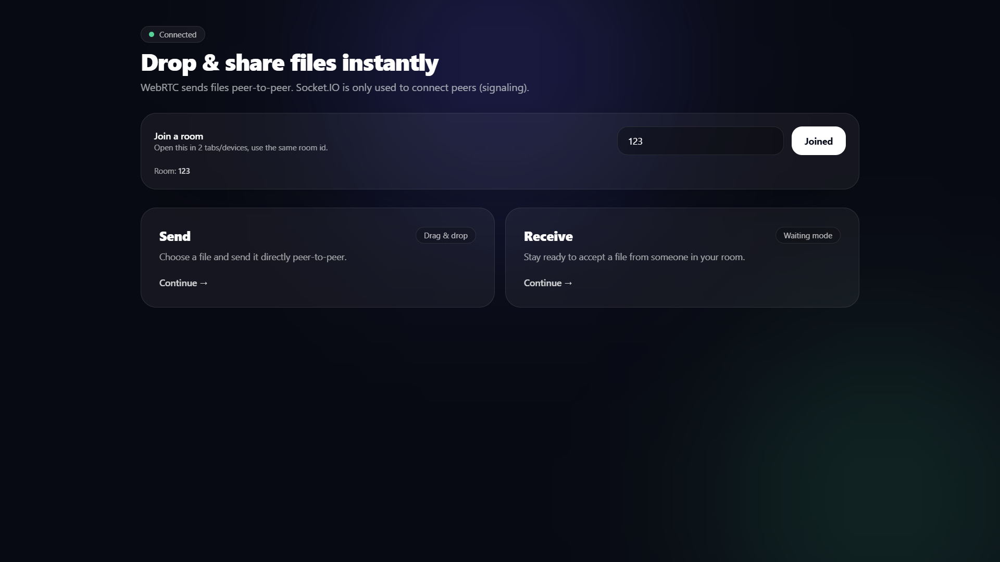
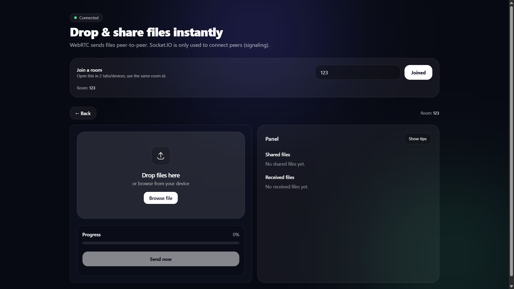
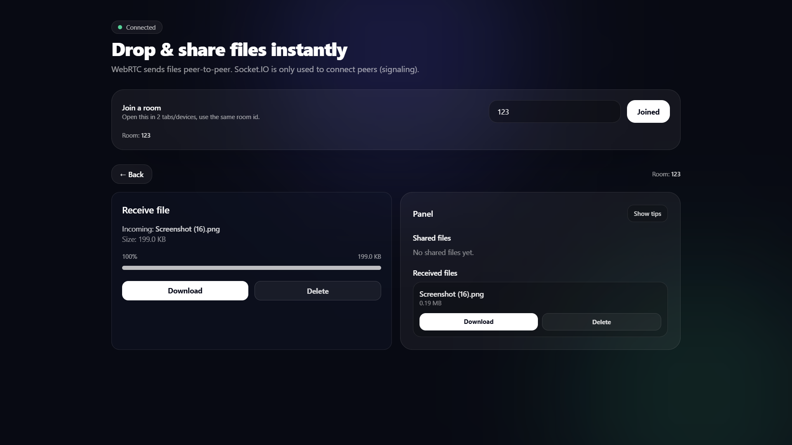
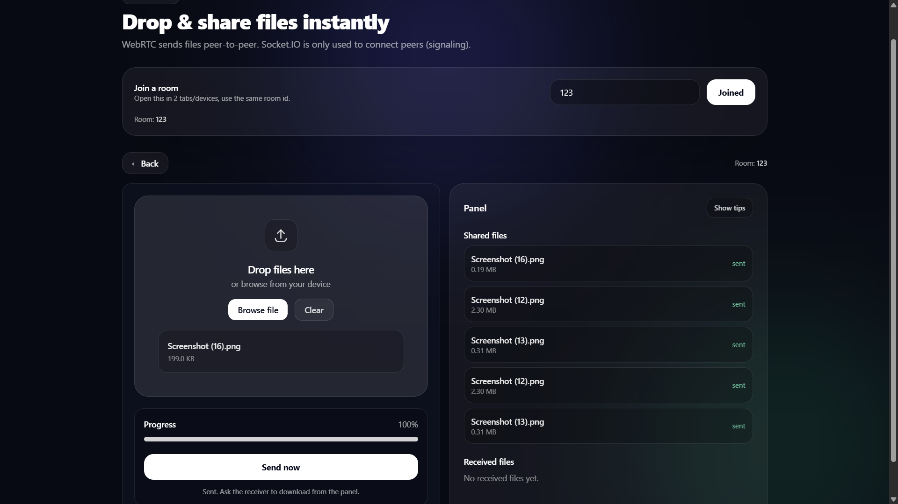

```md
# 🚀 P2P File Transfer App (WebRTC + Socket.IO)

A modern **peer-to-peer file sharing application** inspired by Netlify Drop / ShareDrop.  
Files are transferred **directly between devices using WebRTC DataChannels**, while **Socket.IO is used only for signaling**.

No file bytes ever touch the server.

---

## ✨ Key Features

- 🔗 **Room-based file sharing**
- 📁 **Drag & Drop + Manual file selection**
- 🔒 **True peer-to-peer transfer using WebRTC**
- ⚡ **High performance (no server bandwidth usage)**
- 📊 **Real-time progress tracking**
- 📥 **Download / Delete controls**
- 🧾 **Shared & Received files panel**
- 🎨 **Clean UI inspired by Netlify Drop**
- 🧠 **Type-safe React + TypeScript codebase**

---

## 🛠 Tech Stack

**Frontend**

- React (Vite)
- TypeScript
- Tailwind CSS
- WebRTC (RTCPeerConnection + DataChannel)
- Socket.IO Client

**Backend**

- Node.js
- Express
- Socket.IO (signaling only)

---

## 🧠 Architecture Overview
```

Sender Browser ────────► Receiver Browser
▲ ▲
│ │
└──── Socket.IO ──────┘
(Signaling only)

````

- **Socket.IO**
  - Exchanges offer, answer, ICE candidates
  - No file data passes through server
- **WebRTC**
  - Creates direct peer-to-peer connection
  - Sends file chunks using DataChannel

---

## 📸 Screenshots

### 🏠 Home / Join Room


### 📤 Sender – Drag & Drop


### 📥 Receiver – Download & Delete


### 📂 Shared & Received Files Panel


---

## ▶️ Getting Started

### Backend
```bash
cd backend
pnpm install
node server.js
````

Runs at: `http://localhost:3000`

### Frontend

```bash
cd frontend
pnpm install
pnpm dev
```

Runs at: `http://localhost:5173`

---

## 🧪 How To Use

1. Open app in **two tabs or devices**
2. Enter the **same room ID**
3. One user selects **Send**
4. Other selects **Receive**
5. Drag & drop a file → instant transfer 🚀

---

## ⚠️ Limitations

- Uses **STUN only**
- Some restricted networks may block P2P connections

👉 Production systems require a **TURN server**.

---

## 🔮 Future Enhancements

- Pause / resume transfer
- Multiple file support
- Encryption layer on chunks
- TURN server fallback
- Shareable room links
- Mobile-first UI

---

## 👤 Author

**Kritmaan Rao**
B.Tech CSE | Backend & Systems Enthusiast

---

```

## 3️⃣ System Design explanation

---

### Step-by-step flow

**1. Room Join**
- Both users join the same room via Socket.IO
- Server maps sockets by room ID

**2. WebRTC Signaling**
- Sender creates a WebRTC offer
- Offer is sent to receiver through Socket.IO
- Receiver replies with an answer
- ICE candidates exchanged for NAT traversal

**3. DataChannel Creation**
- Once signaling completes, WebRTC establishes a direct connection
- A `RTCDataChannel` is opened for binary data

**4. File Transfer**
- Sender:
  - Sends file metadata (name, size, type)
  - Splits file into fixed-size chunks
  - Streams chunks via DataChannel
- Receiver:
  - Collects chunks into memory
  - Reconstructs file using `Blob`
  - Exposes Download/Delete actions

**5. Cleanup**
- Object URLs are revoked
- Channels and peer connections closed

---

### Why this design is efficient

- 🚫 No server bandwidth usage
- ⚡ Lower latency
- 🔐 Better privacy
- 📈 Scales better than server-based uploads

---

### Trade-offs

- Requires TURN servers in restrictive networks
- Browser memory limits for very large files
- Slightly complex signaling logic

---

### How this compares to server upload apps

| Feature | This App | Traditional Upload |
|------|-------|----------------|
Server stores file | ❌ | ✅
Bandwidth cost | Low | High
Privacy | High | Medium
Scalability | Better | Limited

---
```
